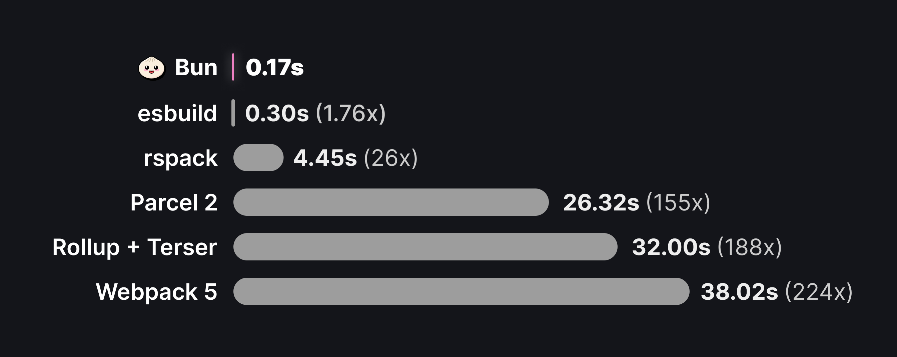

# `Bun.build`

Bun 的快速原生打包器，现在处于测试阶段。它可以通过 `bun build` CLI 命令或 Bun.build() JavaScript API 使用。

:::code-group

```ts [JavaScript]
await Bun.build({
	entrypoints: ['./index.tsx'],
	outdir: './build',
});
```

```sh [CLI]
$ bun build ./index.tsx --outdir ./build
```

:::

> bun 很快。下面的数字代表了 esbuild 的 [three.js 基准测试的性能](https://github.com/oven-sh/bun/tree/main/bench/bundle)。



> 从头开始打包 three.js 的 10 个副本，使用 sourcemaps 和 minification

## 为什么要打包？

bundler 是 JavaScript 生态系统中的关键基础设施。简要概述为什么打包如此重要:

- **减少 HTTP 请求**： `node_modules` 中的单个包可能包含数百个文件，大型应用程序可能具有数十个类似依赖项。使用单独的 HTTP 请求加载这些文件中的每一个效率很低下，因此使用打包程序将我们的应用程序源代码转换为较少数量的自包含 “捆绑包”，可以通过单个请求加载。

- **代码转换**：现代应用程序通常使用 `TypeScript`，`JSX` 和 `CSS` 模块等语言或工具构建，所有这些都必须转换为纯 `JavaScript` 和 `CSS`，然后才能被浏览器使用。打包器是配置这些转换的自然场所。

- **框架功能**：框架依靠 打包 插件和代码转换来实现常见模式，如文件系统路由、客户端-服务器代码协同定位 (想想 getServerSideProps 或 Remix 加载器) 和服务器组件。

让我们跳到 打包器 API 中。

:::warning 🚨 请注意，Bun 打包器 并非用于替换 tsc 进行类型检测或生成类型声明。 :::

## 基本示例

让我们构建我们的第一个包。您有以下两个文件，它们实现了一个简单的客户端渲染的 React 应用程序。

:::code-group

```tsx [./index.tsx]
import * as ReactDOM from 'react-dom/client';
import { Component } from './Component';

const root = ReactDOM.createRoot(document.getElementById('root'));
root.render(<Component message='Sup!' />);
```

```tsx [./Component.tsx]
import * as ReactDOM from 'react-dom/client';
import { Component } from './Component';

const root = ReactDOM.createRoot(document.getElementById('root'));
root.render(<Component message='Sup!' />);
```

:::

这里，index.tsx 是我们应用程序的 “入口点”。通常，这将是一个执行一些副作用的脚本，例如启动服务器或-在这种情况下-初始化 React root。因为我们使用的是 `TypeScript` 和 `JSX`，所以我们需要将代码打包在一起，然后才能将其发送到浏览器。

要创建我们的包:
:::code-group

```tsx [JavaScript]
await Bun.build({
	entrypoints: ['./index.tsx'],
	outdir: './out',
});
```

```sh [CLI]
$ bun build ./index.tsx --outdir ./out
```

:::

对于入口点中指定的每个文件，Bun 将生成一个新的包。该包将被写入磁盘的./out 目录 ( 从当前工作目录解析 )。运行构建后，文件系统如下所示：

```
.
├── index.tsx
├── Component.tsx
└── out
    └── index.js
```

out/index.js 的内容将如下所示:

```js
// ...
// ~20k lines of code
// including the contents of `react-dom/client` and all its dependencies
// this is where the $jsxDEV and $createRoot functions are defined

// Component.tsx
function Component(props) {
	return $jsxDEV(
		'p',
		{
			children: props.message,
		},
		undefined,
		false,
		undefined,
		this
	);
}

// index.tsx
var rootNode = document.getElementById('root');
var root = $createRoot(rootNode);
root.render(
	$jsxDEV(
		Component,
		{
			message: 'Sup!',
		},
		undefined,
		false,
		undefined,
		this
	)
);
```

:::details 教程: 在浏览器中运行此文件
我们可以在浏览器中加载此文件，以查看我们的应用程序。在 out 目录中创建一个 index.html 文件:

```sh
$ touch out/index.html
```

然后将以下内容粘贴到其中:

```html
<html>
	<body>
		<div id="root"></div>
		<script type="module" src="/index.js"></script>
	</body>
</html>
```

然后启动一个服务于 out 目录的静态文件服务器:

```sh
$ bunx serve out
```

请访问 http:// localhost:5000 查看打包的应用程序的运行情况。
:::

## 监视模式

与运行库和测试运行器一样，打包器本身也支持监视模式。

```sh
$ bun build ./index.tsx --outdir ./out --watch
```

## 内容类型

与 Bun 运行时一样，打包器支持开箱即用的文件类型数组。下表分解了打包器的标准 “加载器” 集。有关完整文档，请参阅 [Bundler > File types](/docs/runtime/loaders)。

---

`.js` `.cjs` `.mjs` `.mts` `.cts` `.ts` `.tsx`

> 详细信息： 使用 Bun 的内置转换器来解析文件，并将 TypeScript/JSX 语法转换为 vanilla JavaScript。bundler 执行一组默认转换，包括死代码消除，树摇动和环境变量内联。目前，Bun 不会尝试向下转换语法; 如果您最近使用 ECMAScript 语法，这将反映在捆绑代码中。

---

`.json`

> JSON 文件被解析并作为 JavaScript 对象内联到包中。

```sh
import pkg from "./package.json";
pkg.name; // => "my-package"
```

---

`.txt`

> 文本文件的内容被读取并作为字符串内联到包中。

```sh
import contents from "./file.txt";
console.log(contents); // => "Hello, world!"
```

---

`.node` `.wasm`

> 这些文件受 Bun 运行时支持，但在绑定期间它们被视为[资源](/docs/bundler#assets)。

## 资产

如打包器遇到扩展名无法识别的导入，它会将导入的文件视为外部文件。引用的文件将按原样复制到 outdir 中，并将导入解析为该文件的路径。
:::code-group

```ts [Input]
// bundle entrypoint
import logo from './logo.svg';
console.log(logo);
```

```ts [Output]
// bundled output
var logo = './logo-ab237dfe.svg';
console.log(logo);
```

:::

> 文件加载器的确切行为也受 [`naming`](/docs/bundler#naming) 和 [`publicPath`](/docs/bundler#publicpath) 的影响。

有关文件加载器的更多完整文档，请参阅 [bundler > Loaders](/docs/bundler/loaders#file) 页面。

## 插件

可以使用 [插件](/docs/bundler/plugins) 覆盖或扩展此表中描述的行为。有关完整文档，请参阅 [Bundler> loader](/docs/bundler/plugins) 页面。

## API

## `entrypoints`

必填项. 与应用程序的入口点相对应的路径数组。将为每个入口点生成一个包。

:::code-group

```ts [JavaScript]
const result = await Bun.build({
	entrypoints: ['./index.ts'],
});
// => { success: boolean, outputs: BuildArtifact[], logs: BuildMessage[] }
```

```sh [CLI]
$ bun build --entrypoints ./index.ts
# the bundle will be printed to stdout
# <bundled code>
```

:::

## `outdir`

将写入输出文件的目录。

:::code-group

```ts [JavaScript]
const result = await Bun.build({
	entrypoints: ['./index.ts'],
	outdir: './out',
});
// => { success: boolean, outputs: BuildArtifact[], logs: BuildMessage[] }
```

```sh [CLI]
$ bun build --entrypoints ./index.ts --outdir ./out
# 打包文件的摘要将打印到stdout
```

:::

如果 outdir 没有传递给 JavaScript API，打包的代码将不会写入磁盘。打包文件在 BuildArtifact 对象数组中返回。这些对象是具有额外属性的 Blobs; 有关完整文档，请参见[产出](/docs/bundler#outputs)。

```ts
const result = await Bun.build({
	entrypoints: ['./index.ts'],
});

for (const result of result.outputs) {
	// 可以作为 blob 使用
	await result.text();

	// Bun将设置Content-Type和Etag标头
	new Response(result);

	// 可以手动编写，但在这种情况下应该使用 'outdir'。
	Bun.write(path.join('out', result.path), result);
}
```

当设置 outdir 时，BuildArtifact 上的 path 属性将是它写入的绝对路径。

## `target`

打包的预期执行环境。
:::code-group

```js [JavaScript]
await Bun.build({
	entrypoints: ['./index.ts'],
	outdir: './out',
	target: 'browser', // default
});
```

```sh [CLI]
$ bun build --entrypoints ./index.ts --outdir ./out --target browser
```

:::
`
根据目标，Bun 将应用不同的模块解析规则和优化。

---

`browser`

> 默认值。用于生成供浏览器执行的包。在解析导入时优先考虑 “浏览器” 导出条件。导入任何内置模块，如 node:events 或 node:path 将起作用，但调用一些函数，如 fs.readFile 将不起作用。

---

`bun`

> 用于生成旨在由 Bun 运行时运行的 bundle。在许多情况下，没有必要捆绑服务器端代码; 您可以直接执行源代码而无需修改。但是，捆绑服务器代码可以减少启动时间并提高运行性能。

> 使用 target: “bun” 生成的所有捆绑包都带有特殊的 // @ bun pragma 标记，这向 Bun 运行时指示在执行之前无需重新转译文件。

> 如果任何入口点包含 Bun shebang (#!/usr/bin/env bun)，捆绑程序将默认为 target: “bun” 而不是 “browser”。

---

`node`

> 用于生成打算由 Node.js 运行的包。解析导入时优先考虑“node”导出条件，并输出.mjs。在未来，这将自动多填充 Bun global 和其他内置的 BUN：\*模块，尽管这还没有实现。

---

等待翻译...
