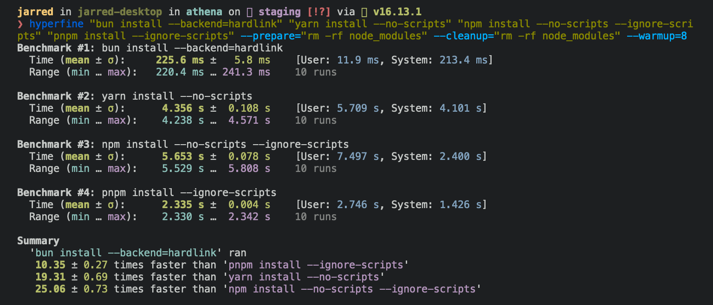

## bun 安装

`bun` CLI 包含一个与 Node.js 兼容的包管理器，旨在大大加快 `npm`、`yarn` 和 `pnpm` 的替代速度。它是一个独立的工具，可以在预先存在的 `Node.js` 项目中工作; 如果您的项目有 `package.json`，`bun install` 可以帮助您加快工作流程。

> ⚡️ 快 25 倍-在任何 Node.js 项目中从 npm 安装切换到 bun 安装，使安装速度提高 25 倍。



:::details 🚨 针对 Linux 用户
最低 Linux 内核版本为 5.1。如果您使用的是 Linux 内核 5.1-5.5，BUN 安装应该仍然有效，但是由于缺乏对 io_uring 的 Connect()操作的支持，HTTP 请求将会很慢。

如果您使用的是 Ubuntu 20.04，下面介绍如何安装更新的内核：

```sh
# 如果这返回的版本 >= 5.6，你不需要做任何事情
$ uname -r

# 安装官方Ubuntu硬件支持内核
$ sudo apt install --install-recommends linux-generic-hwe-20.04
```

:::

## bun install

要安装项目的所有依赖项:

```sh
$ bun install
```

在 Linux 上，`bun install` 往往比 npm install 快 20-100 倍。在 macOS 上，它更像是 4-80x。


运行 bun 安装将:

- 安装所有依赖项、`DevDependency` 和 `optionalDependency`。默认情况下，Bun 不安装 `peerDependency`。

- 在适当的时间运行项目的 `{pre | post } install` 和 `{pre | post}prepare` 脚本。出于安全原因，Bun 不会执行已安装依赖项的生命周期脚本。

- 将 `bun.lockb` 锁定文件写入项目根目录。

要在生产模式下安装 (即没有 `devDependencies` 或 `optionalDependencies`):

```sh
$ bun install --production
```

要使用可重现的依赖项进行安装，请使用 `--frozen-lockfile`。如果您的 package.json 不同意 bun.lockb，Bun 将退出并显示错误。这对于生产构建和 CI 环境非常有用。

```sh
$ bun install --frozen-lockfile
```

要执行试运行(即不实际安装任何内容)，请执行以下操作：

```sh
$ bun install --dry-run
```

要修改日志记录详细程度，请执行以下操作：

```sh
bun install --verbose # 调试日志记录
bun install --silent  # 无日志记录
```

:::details 配置行为
可以在 `bunfig.toml` 中配置 `bun install` 的默认行为:

```sh
[install]

# 是否安装 optionalDependencies
optional = true

# 是否安装 devDependencies
dev = true

# 是否安装 peerDependencies
peer = false

# 相当于 `--production` 标志
production = false

# 相当于 `--frozen-lockfile` 标志
frozenLockfile = false

# 相当于 `--dry-run` 标志
dryRun = false
```

:::

## bun add

要添加特定包，请执行以下操作:

```sh
$ bun add preact
```

指定版本、版本范围或标签:

```sh
$ bun add zod@3.20.0
$ bun add zod@^3.0.0
$ bun add zod@latest
```

要将包添加为开发依赖项 ( devDependencies ):

```sh
$ bun add --dev @types/react
$ bun add -d @types/react
```

要将包添加为可选依赖项 ( optionalDependency )，请执行以下操作：

```sh
$ bun add --optional lodash
```

要将软件包和 pin 添加到已解析的版本，请使用 `--exact`。这将解析软件包的版本，并使用确切的版本号而不是版本范围将其添加到 package.json 中。

```sh
$ bun add react --exact
```

这将向您的 Package.json 添加以下内容：

```json
{
	"dependencies": {
		// without --exact
		"react": "^18.2.0", // this matches >= 18.2.0 < 19.0.0

		// with --exact
		"react": "18.2.0" // this matches only 18.2.0 exactly
	}
}
```

要全局安装包，请执行以下操作：

```sh
$ bun add --global cowsay # 或 `bun add -g cowsay`

cowsay "Bun!"
 ______
< Bun! >
 ------
        \   ^__^
         \  (oo)\_______
            (__)\       )\/\
                ||----w |
                ||     ||
```

::: details 配置全局安装行为

```sh
[install]
# 在 “bun install -- global” 安装包的位置
globalDir = "~/.bun/install/global"

# 链接全局安装的 bun 的位置
globalBinDir = "~/.bun/bin"
```

:::

要查看给定命令的完整选项列表，请执行以下操作：

```sh
$ bun add --help
```

## bun remove

要删除依赖项，请执行以下操作：

```sh
$ bun remove preact
```

要将所有依赖项更新为与您的 Package.json 中指定的版本范围兼容的最新版本，请执行以下操作：

```sh
$ bun update
```

这将不会编辑您的 package.json。目前没有命令将所有依赖项强制更新到最新版本，无论版本范围如何。

## `bun link`

使用本地目录中的 bun 链接将当前包注册为 “可链接” 包。

```sh
cd /path/to/cool-pkg
cat package.json
{
  "name": "cool-pkg",
  "version": "1.0.0"
}
bun link
bun link v1.x (7416672e)
Success! Registered "cool-pkg"

To use cool-pkg in a project, run:
  bun link cool-pkg

Or add it in dependencies in your package.json file:
  "cool-pkg": "link:cool-pkg"
```

现在可以使用 `bun link cool-pkg` 将该包“链接”到其他项目中。这将在目标项目的 `node_modules` 目录中创建一个指向本地目录的符号链接。

```sh
cd /path/to/my-app
bun link cool-pkg
```

此外，`-save` 标志可用于将 `coul-pkg` 添加到应用程序的 `package.json` 的依赖项字段中，并带有特殊的版本说明符，该说明符告诉 Bun 从注册的本地目录加载，而不是从 `npm` 安装:

```json
{
	"name": "my-app",
	"version": "1.0.0",
	"dependencies": {
+		"cool-pkg": "link:cool-pkg"
	}
}
```

## 受信任的依赖项

与其他 npm 客户端不同，Bun 不会为已安装的依赖项 (如 postinstall) 执行任意生命周期脚本。这些脚本存在潜在的安全风险，因为它们可以在您的计算机上执行任意代码。

要告诉 Bun 允许特定包的生命周期脚本，请将该包添加到 package.json 中的 trustedDependencies。

```json
{
   "name": "my-app",
   "version": "1.0.0",
+  "trustedDependencies": ["my-trusted-package"]
}
```

Bun 读取此字段，并将运行 `my-trusted-package` 的生命周期脚本。

## Git 依赖项

要从 git 存储库添加依赖项，请执行以下操作：

```sh
$ bun install git@github.com:moment/moment.git
```

Bun 支持多种协议，包括 [github](https://docs.npmjs.com/cli/v9/configuring-npm/package-json#github-urls)、[git](https://docs.npmjs.com/cli/v9/configuring-npm/package-json#git-urls-as-dependencies) ssh、git https 等等。

```json
{
	"dependencies": {
		"dayjs": "git+https://github.com/iamkun/dayjs.git",
		"lodash": "git+ssh://github.com/lodash/lodash.git#4.17.21",
		"moment": "git@github.com:moment/moment.git",
		"zod": "github:colinhacks/zod"
	}
}
```

## Tarball 依赖项

包名称可以对应于公共托管的 `.tgz` 文件。在 Bun 安装期间，Bun 将从指定的 tarball URL 下载并安装包，而不是从包注册表。

```json
{
	"dependencies": {
		"zod": "https://registry.npmjs.org/zod/-/zod-3.21.4.tgz"
	}
}
```

## CI/CD

想加快你的 CI？使用官方的 `oven-sh/setup-bun` 操作在 GitHub Actions 管道中安装 `bun`。

```yml
# .github/workflows/release.yml
name: bun-types
jobs:
  build:
    name: build-app
    runs-on: ubuntu-latest
    steps:
      - name: Checkout repo
        uses: actions/checkout@v3
      - name: Install bun
        uses: oven-sh/setup-bun@v1
      - name: Install dependencies
        run: bun install
      - name: Build app
        run: bun run build
```
