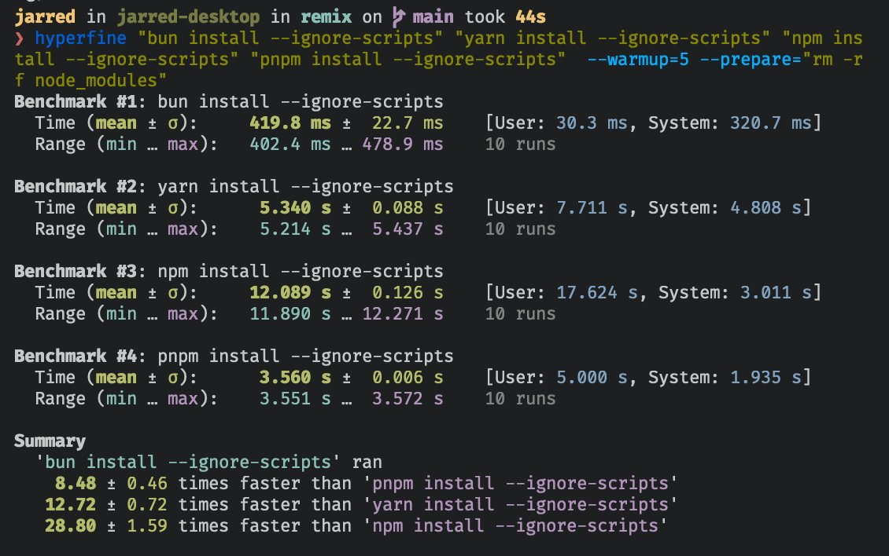

# 工作区

Bun 支持 `Package.json` 中的 [工作区](https://docs.npmjs.com/cli/v9/using-npm/workspaces?v=true#description) 。工作区使得将复杂的软件开发成由几个独立的包组成的 Monorepo 变得很容易。

Monorepo 通常具有以下结构：

```
tree
<root>
├── README.md
├── bun.lockb
├── package.json
├── tsconfig.json
└── packages
    ├── pkg-a
    │   ├── index.ts
    │   ├── package.json
    │   └── tsconfig.json
    ├── pkg-b
    │   ├── index.ts
    │   ├── package.json
    │   └── tsconfig.json
    └── pkg-c
        ├── index.ts
        ├── package.json
        └── tsconfig.json
```

在根目录的 `package.json` 中，“workspaces” 键用于指示哪些子目录应被视为 `monorepo` 中的包/工作区。通常将所有工作区放在一个名为 `packages` 的目录中。

```json
{
	"name": "my-project",
	"version": "1.0.0",
	"workspaces": ["packages/*"],
	"devDependencies": {
		"example-package-in-monorepo": "workspace:*"
	}
}
```

> Glob 支持 - Bun 在工作区支持简单的`<directory>/*` globs 。尚不支持完整的 glob 语法 (例如 \*\* 和 ？)。

每个工作区都有自己的 `package.json` 在 `monorepo` 中引用其他包时，请使用 "workspace:\*" 作为 package.json 中的 version 字段。

```json
{
	"name": "pkg-a",
	"version": "1.0.0",
	"dependencies": {
		"pkg-b": "workspace:*"
	}
}
```

> 版本支持— 面包支持简单 workspace:\* 版本在 "dependencies". 尚不支持完整版语法 (例如： workspace:^\* ) .

## 工作空间有几个主要的好处。

- 代码可以拆分为逻辑部分 - 如果一个包依赖于另一个包，您只需将其作为依赖项添加到 `package.json` 中。如果程序包 b 依赖于 a，`bun install` 会将您的本地 `packages/a` 目录安装到 `node_modules` 中，而不是从 npm 注册表下载它。

- 可以消除重复的依赖关系 - 如果 a 和 b 共享一个共同的依赖关系，它将被提升到根 node_modules 目录。这减少了冗余磁盘的使用，并最大限度地减少了与同时安装多个版本的软件包相关的 “依赖性地狱” 问题。

:::info ⚡️ 速度

即使对于大型 monorepos，安装也很快。Bun 在 Linux 上大约 500 毫秒内安装 Remix monorepo。

- 28x 比 npm 安装更快
- 12x 比 yarn 安装更快 (v1)
- 8x 比 pnpm 安装更快


:::
