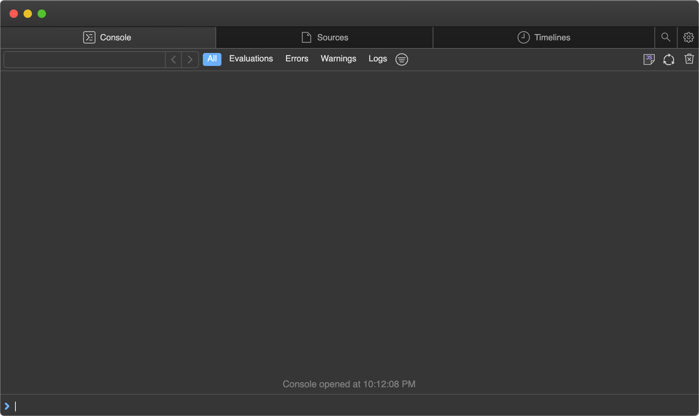
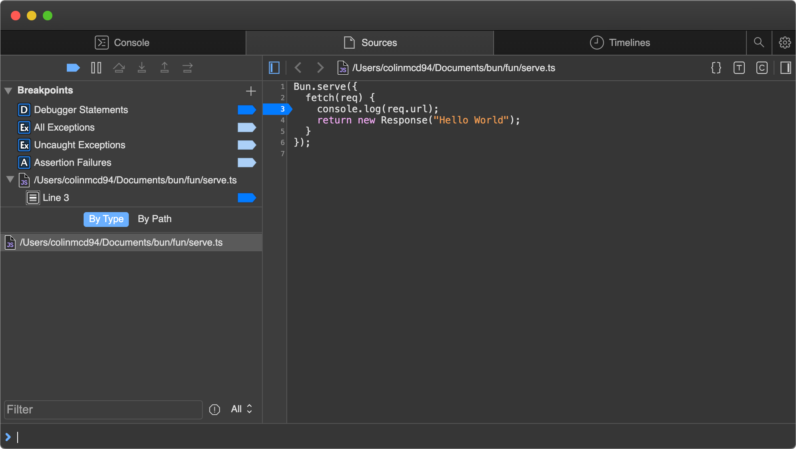
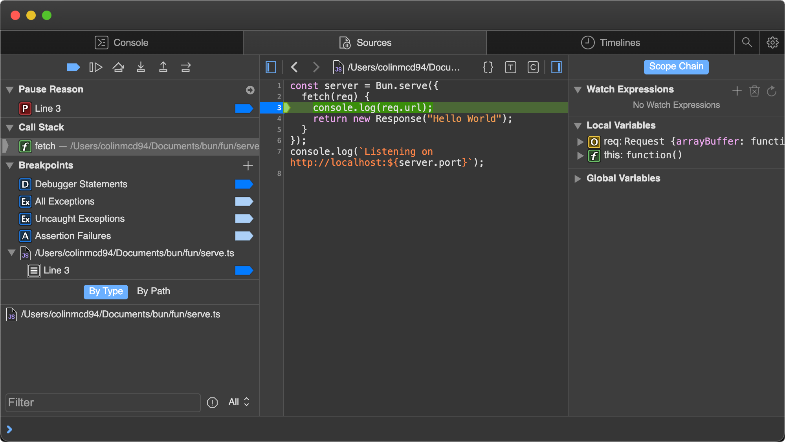
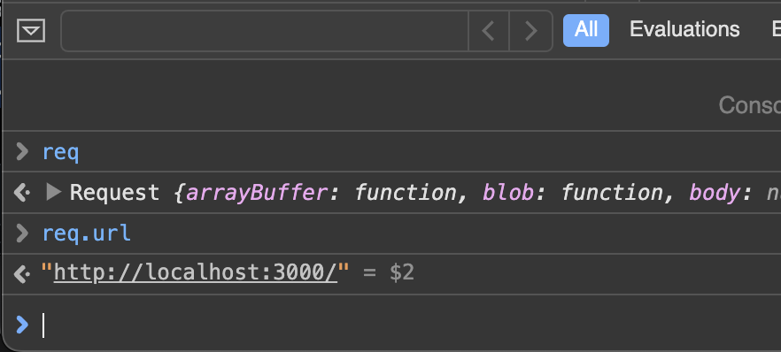
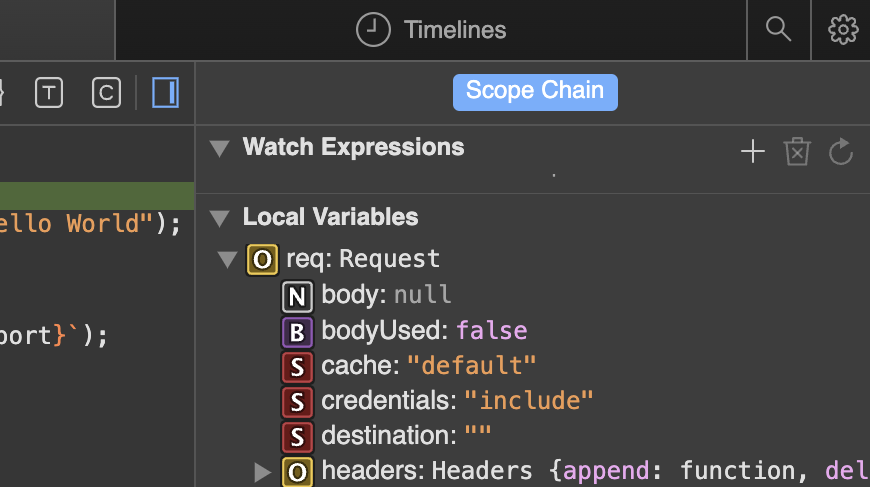
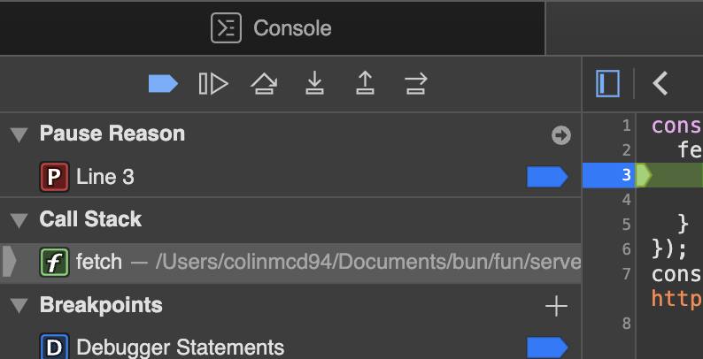
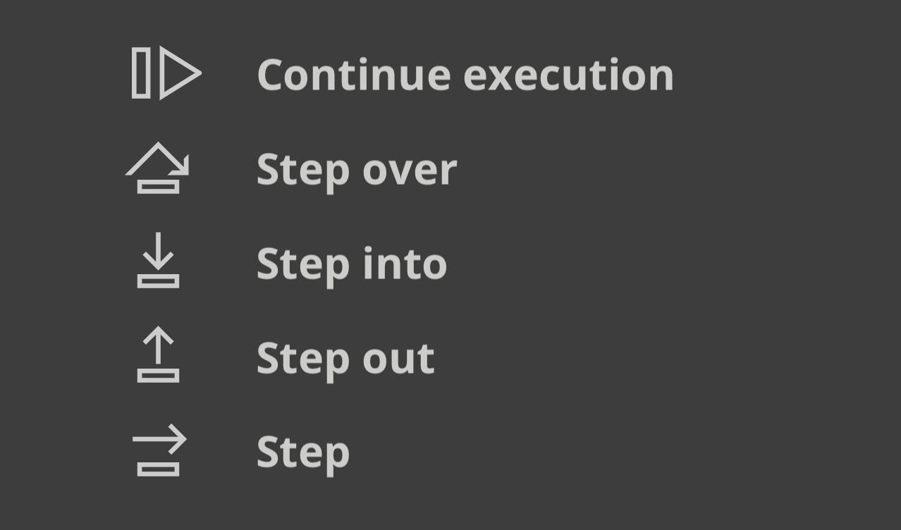

# Debugger ( 调试器 )

Bun 使用 [WebKit Inspector 协议](https://github.com/oven-sh/bun/blob/main/packages/bun-vscode/types/jsc.d.ts)，因此您可以使用交互式调试器调试代码。出于演示目的，请考虑以下简单的 web 服务器。

```ts
Bun.serve({
	fetch(req) {
		console.log(req.url);
		return new Response('Hello, world!');
	},
});
```

## `--inspect`

若要在使用 Bun 运行代码时启用调试，请使用 `--inspect` 标志。这将在可用端口上自动启动 `WebSocket` 服务器，该端口可用于检查正在运行的 Bun 进程。

```sh
$ bun --inspect server.ts

------------------ Bun Inspector ------------------
Listening at:
  ws://localhost:6499/0tqxs9exrgrm

Inspect in browser:
  https://debug.bun.sh/#localhost:6499/0tqxs9exrgrm
------------------ Bun Inspector ------------------
```

## `--inspect-brk`

`--inspect-brk` 标志的行为与 `--inspect` 相同，只是它会在执行的脚本的第一行自动注入一个断点。这对于调试快速运行并立即退出的脚本很有用。

## `--inspect-wait`

`--inspect-wait` 标志的行为与 `--inspect` 相同，只是在调试器附加到正在运行的进程之前，代码不会执行。

## 设置调试器的端口或 URL

```sh
$ bun --inspect=4000 server.ts
$ bun --inspect=localhost:4000 server.ts
$ bun --inspect=localhost:4000/prefix server.ts
```

## Debuggers ( 调试器 )

各种调试工具都可以连接到此服务器，以提供交互式调试体验。

## `debug.bun.sh`

Bun 在 [debug.bun.sh](https://debug.bun.sh/) 中托管基于 web 的调试器。它是 `WebKit` 的 [Web Inspector](https://webkit.org/web-inspector/web-inspector-interface/) 界面的修改版本，Safari 用户看起来很熟悉。

在浏览器中打开提供的 debug.bun.sh URL 以启动调试会话。在该界面中，您将能够查看运行文件的源代码、查看和设置断点以及使用内置控制台执行代码。



让我们设置一个断点。导航到源选项卡; 您应该看到前面的代码。单击行号 3，在我们的 console.log(req.url) 语句上设置断点。



然后在您的 Web 浏览器中访问 [http://localhost:3000](http://localhost:3000) 。这将向我们的本地主机 Web 服务器发送一个 HTTP 请求。页面看起来好像没有加载。为什么？因为程序在我们之前设置的断点处暂停了执行。

请注意用户界面是如何改变的。


在这一点上，我们可以做很多事情来反思当前的执行环境。我们可以使用底部的控制台在程序的上下文中运行任意代码，并在断点处完全访问范围内的变量。



在源代码面板的右侧，我们可以看到当前范围内的所有局部变量，并向下钻取以查看它们的属性和方法。在这里，我们正在检查请求变量。



在源代码窗格的左上角，我们可以控制程序的执行。



下面是一个说明控制流按钮的功能的小数据表。

- 继续执行脚本-继续运行程序，直到下一个断点或异常。

- 跳过-程序将继续到下一行。

- 单步执行--如果当前语句包含函数调用，调试器将“单步执行”被调用的函数。

- 退出-如果当前语句是函数调用，则调试器将完成执行调用，然后将函数 “退出” 到调用它的位置。


