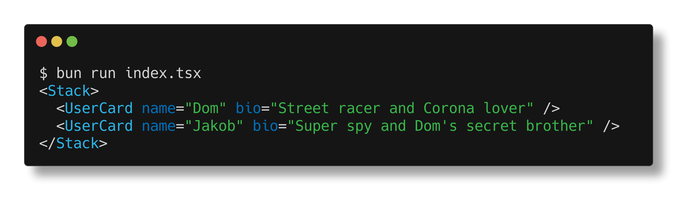

# JSX

Bun 开箱即可支持 `.jsx` 和 `.tsx` 文件。Bun 的内部转换器在执行之前将 JSX 语法转换为普通的 JavaScript。

```tsx
function Component(props: { message: string }) {
	return (
		<body>
			<h1 style={{ color: 'red' }}>{props.message}</h1>
		</body>
	);
}

console.log(<Component message='Hello world!' />);
```

## 配置

Bun 读取您的 tsconfig.json 或 jsconfig.json 配置文件，以确定如何在内部执行 JSX 转换。为了避免使用其中任何一个，还可以在 [bunfig.toml](/docs/runtime/bunfig) 中定义以下选项。

遵循以下编译器选项。

## jsx

JSX 构造如何在内部转换为普通的 JavaScript。下表列出了 JSX 的可能值，以及它们对以下简单 JSX 组件的转换：

```jsx
<Box width={5}>Hello</Box>
```

::: code-group

```json [react]
{
	"jsx": "react"
}
```

```ts [输出]
import { createElement } from 'react';
createElement('Box', { width: 5 }, 'Hello');
```

:::

::: code-group

```json [react-jsx]
{
	"jsx": "react-jsx"
}
```

```jsx [输出]
import { jsx } from 'react/jsx-runtime';
jsx('Box', { width: 5 }, 'Hello');
```

:::

::: info 📌 小知识
`JsxDEV` 变量名是 React 使用的约定。DEV 后缀是一种可见的方式，表示代码旨在用于开发。React 的开发版本速度较慢，并且包括附加的有效性检查和调试工具。
:::

::: code-group

```json [react-jsxdev]
{
	"jsx": "react-jsxdev"
}
```

```jsx [输出]
import { jsxDEV } from 'react/jsx-dev-runtime';
jsxDEV(
	'Box',
	{ width: 5, children: 'Hello' },
	undefined,
	false,
	undefined,
	this
);
```

:::
::: code-group

```json [react]
{
	"jsx": "preserve"
}
```

```jsx [preserve]
// JSX 没有被转译
// Bun目前不支持  "preserve"
<Box width={5}>Hello</Box>
```

:::

## [`jsxFactory`](https://www.typescriptlang.org/tsconfig#jsxFactory)

> 仅在 jsx 为 react 时适用

用于表示 [JSX 片段](https://react.dev/reference/react/Fragment) 的函数名，例如 <>Hello</>; 仅在 jsx 为 react 时适用。默认值为 `"Fragment"`。

::: code-group

```json [react]
{
	"jsx": "react",
	"jsxFactory": "myjsx",
	"jsxFragmentFactory": "MyFragment"
}
```

```jsx
// 输入
<>Hello</>;

// 输出
import { myjsx, MyFragment } from 'react';
myjsx(MyFragment, null, 'Hello');
```

:::

## [`jsxImportSource`](https://www.typescriptlang.org/tsconfig#jsxImportSource)

> 注意-仅当 jsx 为 react-jsx 或 react-jsxdev 时适用。

组件工厂函数 ( `createElement`、`jsx`、`jsxDEV` 等) 将从中导入的模块。默认值为“react”。当使用像 Preact 这样的组件库时，这通常是必要的。

::: code-group

```json [react]
{
	"jsx": "react"
	// 未定义 jsxImportSource
	// 默认为 "react"
}
```

```jsx
import { jsx } from 'react/jsx-runtime';
jsx('Box', { width: 5, children: 'Hello' });
```

:::

::: code-group

```json [react-jsx]
{
	"jsx": "react-jsx",
	"jsxImportSource": "preact"
}
```

```jsx
import { jsx } from 'preact/jsx-runtime';
jsx('Box', { width: 5, children: 'Hello' });
```

:::

::: code-group

```json [react-jsxdev]
{
	"jsx": "react-jsxdev",
	"jsxImportSource": "preact"
}
```

```jsx
// JSX-自动追加运行时
import { jsxDEV } from 'preact/jsx-dev-runtime';
jsxDEV(
	'Box',
	{ width: 5, children: 'Hello' },
	undefined,
	false,
	undefined,
	this
);
```

:::

## JSX pragma

所有这些值都可以使用 pragma 在每个文件的基础上进行设置。pragma 是在特定文件中设置编译器选项的特殊注释。

::: code-group

```jsx
// @jsx h
```

```json
{
	"jsxFactory": "h"
}
```

:::

::: code-group

```jsx
// @jsxFrag MyFragment
```

```json
{
	"jsxFragmentFactory": "MyFragment"
}
```

:::

::: code-group

```jsx
// @jsxImportSource preact
```

```json
{
	"jsxImportSource": "preact"
}
```

:::

## 日志记录

Bun 为 JSX 实现了特殊的日志记录，使调试更加容易。给定以下文件:

```tsx
import { Stack, UserCard } from './components';

console.log(
	<Stack>
		<UserCard name='Dom' bio='Street racer and Corona lover' />
		<UserCard name='Jakob' bio="Super spy and Dom's secret brother" />
	</Stack>
);
```

Bun 将在记录时漂亮的打印出组件树：


## Prop punning

Bun 运行时还支持 JSX 的 "prop punning"。这是一种速记语法，可用于将变量分配给具有相同名称的道具。
